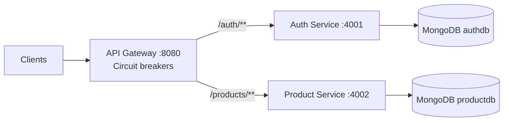

# Spring Boot Microservices

**Tech stack:** Java 17, Spring Boot 3.2.12, Spring Security, JWT, Spring Cloud Gateway, Resilience4j, MongoDB, springdoc OpenAPI, Spring Boot Actuator, Docker Compose, JUnit 5, GitHub Actions

## What this project does

This small three-service demo lets users register and log in to receive JWTs, while a product service provides a catalog with public reads and authenticated writes. The API gateway routes authentication and product requests, and the product-service validates JWTs before allowing product creation and other writes. If a downstream service is unavailable, a Resilience4j circuit breaker returns an HTTP 503 fallback. The project demonstrates service separation, a separate MongoDB database per service, JWT security, API gateway routing, Docker Compose, and CI. Each service is an independent Maven project.

## Architecture



The gateway forwards `/auth/**` and `/products/**` unchanged. Compose publishes the gateway on host port `8080` and MongoDB on host port `27017` by default; auth (`4001`) and product (`4002`) ports remain internal to the Compose network. `GATEWAY_HOST_PORT` and `MONGO_HOST_PORT` can override the host-side ports. MongoDB uses separate `authdb` and `productdb` databases. If a downstream call fails, the gateway circuit breaker forwards to `/fallback`, which returns HTTP 503.

## Services and Endpoints

| Service | Port | Method and endpoint | Auth | Success | Error/other |
| --- | ---: | --- | --- | --- | --- |
| `auth-service` | 4001 | `POST /auth/register` | Public | 201 | 400 invalid body; 409 duplicate email |
| `auth-service` | 4001 | `POST /auth/login` | Public | 200 | 400 invalid body; 401 invalid credentials |
| `auth-service` | 4001 | `GET /actuator/health` | Public | 200 | |
| `auth-service` | 4001 | `GET /v3/api-docs` | Public | 200 | |
| `auth-service` | 4001 | `GET /swagger-ui/index.html` | Public | 200 | |
| `product-service` | 4002 | `GET /products` | Public | 200 | |
| `product-service` | 4002 | `GET /products/{id}` | Public | 200 | 404 product not found |
| `product-service` | 4002 | `POST /products` | JWT | 200 | 400 invalid body; 401 missing/invalid token |
| `product-service` | 4002 | `PUT /products/{id}` | JWT | 200 | 400 invalid body; 401 missing/invalid token; 404 product not found |
| `product-service` | 4002 | `DELETE /products/{id}` | JWT | 204 | 401 missing/invalid token; 404 product not found |
| `product-service` | 4002 | `GET /actuator/health` | Public | 200 | |
| `product-service` | 4002 | `GET /v3/api-docs` | Public | 200 | |
| `product-service` | 4002 | `GET /swagger-ui/index.html` | Public | 200 | |
| `api-gateway` | 8080 | All methods: `/auth/**`, `/products/**` | Same as downstream endpoint | Downstream status | 503 when circuit breaker falls back |
| `api-gateway` | 8080 | `GET /actuator/health` | Public | 200 | |
| `api-gateway` | 8080 | Any method: `/fallback` | Public | 503 | Circuit-breaker response |

The gateway only routes requests and does not validate JWTs. The `product-service` filter validates JWT signature and expiry for `POST`, `PUT`, and `DELETE` under `/products`. Product reads are public. Product write bodies require a nonblank `name` and `price > 0`. Registration stores a BCrypt hash and returns only the user ID and email; login issues a signed JWT that expires after one hour. The DELETE endpoint returns 204 on success.

Auth, product, gateway fallback, and product JWT-filter errors use this JSON shape; `timestamp` is ISO 8601:

```json
{"timestamp":"2026-09-29T12:00:00Z","status":404,"error":"Not Found","message":"Product not found"}
```

## Run With Docker Compose

Copy `.env.example` to `.env`, replace the `JWT_SECRET` placeholder with a random secret of at least 32 bytes, then run from the repository root. `.env.example` contains sample values, not a usable secret; `.env` is ignored by Git.

```bash
docker compose up --build
```

MongoDB health is checked with `mongosh` every 5 seconds (3-second timeout, 20 retries). Auth and product healthchecks call their `/actuator/health` endpoints every 10 seconds (5-second timeout, 12 retries, 25-second start period). Compose starts auth and product after MongoDB is healthy, then starts the gateway after both services are healthy. Health URLs are `http://localhost:8080/actuator/health` for the published gateway and, when running services directly, `http://localhost:4001/actuator/health` and `http://localhost:4002/actuator/health`.

The auth and product ports are not published by Compose. Their Swagger UI URLs are `http://localhost:4001/swagger-ui/index.html` and `http://localhost:4002/swagger-ui/index.html` when those services run directly or their ports are otherwise published; Compose users can reach them from the internal network at `http://auth-service:4001/swagger-ui/index.html` and `http://product-service:4002/swagger-ui/index.html`. OpenAPI documents are at `/v3/api-docs` on each service. MongoDB is published on `27017` and the gateway on `8080` by default; set `MONGO_HOST_PORT` or `GATEWAY_HOST_PORT` in `.env` if either host port is already in use. Stop the stack with `Ctrl+C` or `docker compose down`; the MongoDB volume is retained.

## Environment Variables

| Variable | Used by | Purpose/default |
| --- | --- | --- |
| `JWT_SECRET` | Auth and product services | Required shared HMAC signing secret; Compose has no fallback value. Set it in `.env` or the shell. |
| `AUTH_MONGO_URI` | Compose | Auth database URI; defaults to `mongodb://mongo:27017/authdb`. |
| `PRODUCT_MONGO_URI` | Compose | Product database URI; defaults to `mongodb://mongo:27017/productdb`. |
| `MONGO_URI` | Auth or product service | Direct-run Mongo URI; defaults to `mongodb://localhost:27017/authdb` or `mongodb://localhost:27017/productdb`, respectively. Compose maps the service-specific URI above into this variable. |
| `MONGO_HOST_PORT` | Compose | Host port mapped to MongoDB container port 27017; defaults to `27017`. |
| `GATEWAY_HOST_PORT` | Compose | Host port mapped to gateway container port 8080; defaults to `8080`. |
| `AUTH_SERVICE_URL` | Gateway when run directly | Auth service address; application default is `http://localhost:4001`. Compose sets `http://auth-service:4001`. |
| `PRODUCT_SERVICE_URL` | Gateway when run directly | Product service address; application default is `http://localhost:4002`. Compose sets `http://product-service:4002`. |

`.env.example` lists `JWT_SECRET`, both service-specific Mongo URIs, and the host-port defaults. Copy it to `.env` and replace the JWT placeholder before starting the stack. No default JWT secret is committed.

## API Walkthrough

These Bash commands exercise the complete flow through the gateway. They require `curl` and `jq`.

Register, then repeat registration to receive 409:

```bash
curl -i -X POST http://localhost:8080/auth/register \
  -H 'Content-Type: application/json' \
  -d '{"email":"user@example.com","password":"change-me"}'

curl -i -X POST http://localhost:8080/auth/register \
  -H 'Content-Type: application/json' \
  -d '{"email":"user@example.com","password":"change-me"}'
```

Log in and capture the JWT:

```bash
TOKEN=$(curl -sS -X POST http://localhost:8080/auth/login \
  -H 'Content-Type: application/json' \
  -d '{"email":"user@example.com","password":"change-me"}' | jq -r '.token')
```

Try a product write without a token (401), then create one with the JWT:

```bash
curl -i -X POST http://localhost:8080/products \
  -H 'Content-Type: application/json' \
  -d '{"name":"Keyboard","price":49.99}'

PRODUCT_ID=$(curl -sS -X POST http://localhost:8080/products \
  -H "Authorization: Bearer $TOKEN" \
  -H 'Content-Type: application/json' \
  -d '{"name":"Keyboard","price":49.99}' | jq -r '.id')

curl http://localhost:8080/products
curl "http://localhost:8080/products/$PRODUCT_ID"
curl -i -X PUT "http://localhost:8080/products/$PRODUCT_ID" \
  -H "Authorization: Bearer $TOKEN" \
  -H 'Content-Type: application/json' \
  -d '{"name":"Mechanical Keyboard","price":59.99}'

curl -i -X DELETE "http://localhost:8080/products/$PRODUCT_ID" \
  -H "Authorization: Bearer $TOKEN"
```

## Build and Test

Run each independent Maven verification from the repository root:

```bash
mvn -B verify -f auth-service/pom.xml
mvn -B verify -f product-service/pom.xml
mvn -B verify -f api-gateway/pom.xml
```

The current JUnit 5 test-method counts are **11** for `auth-service`, **18** for `product-service`, and **9** for `api-gateway` (38 total). These counts are from the `@Test` methods in the test source files. Coverage includes auth success/failure, duplicate emails, password-hash omission, product CRUD and not-found cases, validation, JWT requirements, gateway routes, and fallbacks.

## Design Decisions

- **Database per service:** auth and product own separate MongoDB databases, keeping their data and schemas independent without adding another database technology.
- **Circuit breaker:** Resilience4j prevents repeated calls to an unavailable downstream service and returns a clear 503 fallback.
- **Stateless JWT:** the auth service issues signed, expiring tokens; the product-service verifies them locally for write requests, avoiding a database lookup on each product mutation.

## Limitations

- No service discovery or centralized configuration; the gateway uses configured service URLs.
- No distributed tracing dependency or instrumentation.
- The services do not call each other directly; the gateway routes to them independently.
- There is no pagination or role-based authorization.
- Test coverage is limited to 11 JUnit test methods across 2 test classes in `auth-service`, 18 across 2 in `product-service`, and 9 across 3 in `api-gateway`.
- `JWT_SECRET` must be provided to both auth and product services; secret provisioning and rotation are outside this demo.

## Possible Next Steps

- Add pagination to the product catalog.
- Add role-based authorization if different access levels are needed.
- Add service discovery and centralized configuration.
- Add distributed tracing.
- Expand automated test coverage.

## CI

GitHub Actions runs Maven `verify` for all three services on Java 17, caches Maven dependencies, and runs on pushes and pull requests targeting `main`.

[](https://github.com/Pratham-131/spring-boot-microservices/actions/workflows/ci.yml)